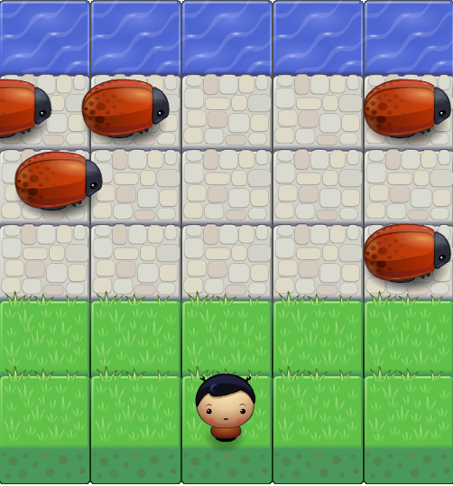

frontend-nanodegree-arcade-game
===============================

Students should use this [rubric](https://review.udacity.com/#!/projects/2696458597/rubric) for self-checking their submission. Make sure the functions you write are **object-oriented** - either class functions (like Player and Enemy) or class prototype functions such as Enemy.prototype.checkCollisions, and that the keyword 'this' is used appropriately within your class and class prototype functions to refer to the object the function is called upon. Also be sure that the **readme.md** file is updated with your instructions on both how to 1. Run and 2. Play your arcade game.

For detailed instructions on how to get started, check out this [guide](https://docs.google.com/document/d/1v01aScPjSWCCWQLIpFqvg3-vXLH2e8_SZQKC8jNO0Dc/pub?embedded=true).

# Javascript Frogger Game
This is a small 2d game written in Javascript. The game challenges little Gary to cross a stone path crawling with Humongous bugs. Can you help little gary to fetch water on the other side.

## Requirements and how to:

+ All you need is a browser and the files included here.
+ Since the game is written in JS. It sould run on most modern browsers.
+ Just navigate to the directory where you downloaded the game and open the index.html file

## How to play
+ Use the arrow keys to move the player in the desired direction.
+ Avoid the bugs as colliding with them will reset the player to the starting position.
+ Avoid attempting to go out of bounds as this will also reset the player to the starting position.
+ Complete the game by helping little Gary to get to the stream.
